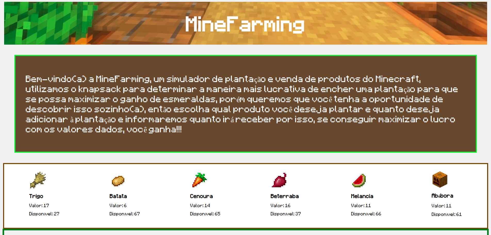
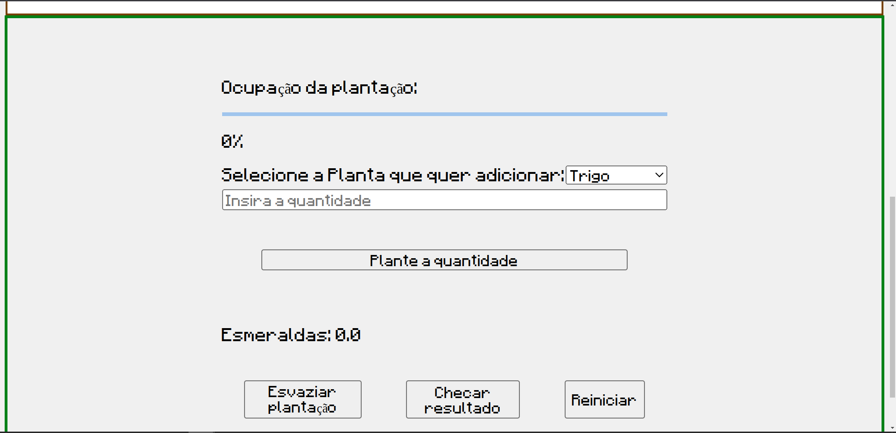
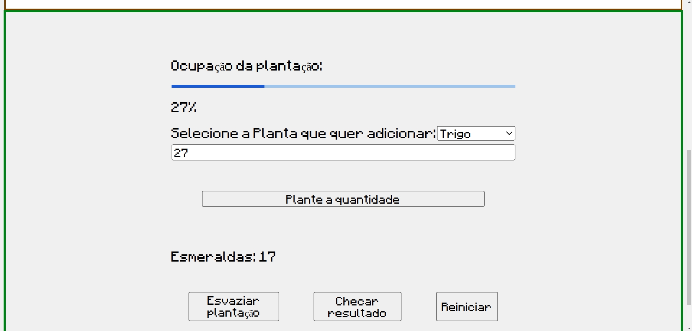
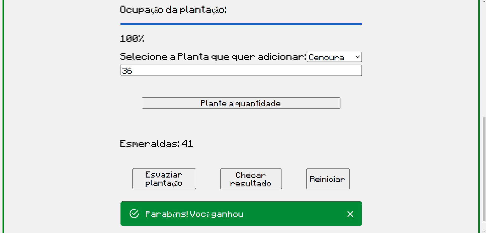

# MineFarming

**Conteúdo da Disciplina**: Algoritmos Ambiciosos<br>

## Alunos

| Matrícula   | Aluno                        |
| ----------- | ---------------------------- |
| 21/1039662  | Pedro Henrique da Silva Melo |
| 20/2063300  | João Pedro Rodrigues Morbeck |

## Sobre 
MineFarming é um jogo, de temática de Minecraft, baseado no algoritmo Knapsack onde o usuário é colocado em uma situação em que deve escolher as plantas mais valiosas para encher sua plantação e maximizar o lucro de esmeralda. Para isso é utilizado um algoritmo gerador de problema e o algoritmo Knapsack para definir a resposta correta. O usuário ganha ao escolher as plantas corretas e as quantidades corretas.


O vídeo pode ser encontrado [aqui](./public/video/entrega-greed.zip) ou pode ser visto do youtube através deste [link](https://youtu.be/MdsIuwSGmjM)

## Screenshots








## Instalação 
**Linguagem**: Javascript<br>
**Framework**: React.js<br>

É necessário ter Node.js instalado (recomendado versão 18 ou posterior) que pode ser baixado [aqui](https://nodejs.org/en), na pasta do projeto, execute o seguinte comando.

``` bash
npm install
```

``` bash
npm run dev
```

o projeto estará no https://localhost:5173

## Uso 
O algoritmo irá gerar o jogo ao entrar no site, em seguida fica a critério do jogador decidir qual planta da lista deseja adicionar, a quantidade máxima que pode se adicionar está no campo "Disponível" de cada planta e não é permitido adicionar a mesma planta duas vezes. Selecione a planta desejada no input dropdown e informe a quantidade que deseja adicionar, em seguida clique no boão "Plante a quantidade", a artir dai a planta será adicionada à plantação e a barra de ocupação irá aumentar, ao completar 100%, clique no botão "Checar resultado" e saberá se acertou ou.não, caso queira tentar novamente ou concertar algum erro na hora de adicionar a planta, clique em "Esvaziar plantação" para zerar a ocupação da plantação, o botão "Reiniciar" zera a ocupação e gera um novo problema para se resolver.

## Outros 
No console do navegador (Ctrl + Shift + C) se encontra o valor total possível do problema, quais itens devem ser escolhidos e suas quantidades.
